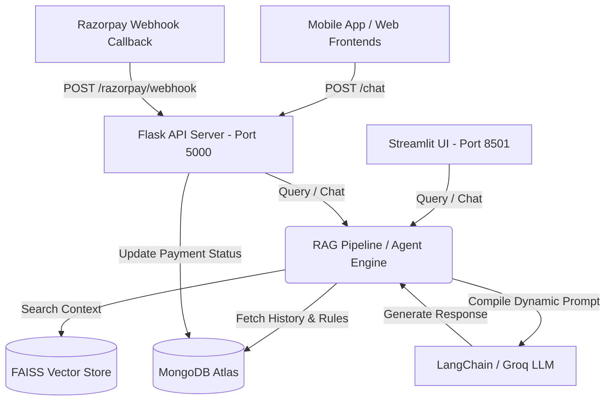

# 🙏 Naman Darshan AI — Chatbot & Booking Assistant

An advanced, production-grade AI sales and customer assistant built for **Naman Darshan** (operated by *Traininglobe Consultancy Pvt Ltd*). The assistant helps devotees plan temple visits (Darshan), book pujas, discover yatra packages, buy prasadam/chadhava, seek astrological services, and handle payment queries with zero-risk guarantees.

The application integrates an LLM-driven agentic chat workflow with a multi-layered RAG (Retrieval-Augmented Generation) pipeline, a local FAISS vector store, MongoDB database storage, a beautiful custom-styled Streamlit UI, and a Flask REST API complete with Razorpay payment webhook integration.

---

## 🏗️ Architecture Overview

The system runs in a co-existence model where the Streamlit UI (for interactive testing/direct user interface) and the Flask API (for backend integration and payment webhooks) share the same underlying core logic, database, and vector store.



---

## 🌟 Key Features

### 1. 🛕 Devotional RAG Engine
*   **FAISS Vector Store:** Indices rich details on seasonal travel guidelines (optimal months for all major Indian temples), state-wise temple categories, Char Dham pathways, and Jyotirlinga circuits.
*   **Intelligent QA & Retrieval:** Pulls contextual data to resolve specific devotee queries instantly.

### 2. 🛡️ Sales & Objection Handling
*   **Trust Building:** Automatically addresses legal vs. brand name differences (e.g., brand *Naman Darshan* vs. legal entity *Traininglobe Consultancy Pvt Ltd*) using realistic company analogies like Zomato/Swiggy.
*   **Payment Objections:** Proactively offers secure bank transfers (NEFT/IMPS) to clear customer hesitation around QR code payments.
*   **Tax Compliance:** Explains GST exemption on religious coordination services under Indian tax laws.

### 3. 💳 Razorpay Payment Webhooks
*   **Secure Validation:** Flask server processes incoming Razorpay events (`payment_link.paid`) using HMAC SHA256 signature verification.
*   **Real-time Database Sync:** Automatically updates customer booking and payment status in MongoDB upon payment confirmation.

### 4. 🎨 Premium Streamlit Interface
*   **Themed Ambiance:** Custom CSS styling incorporating deep temple colors (marigold orange, dark woods, and gold gradients).
*   **Devotional Ticker:** Interactive scrolling ticker header displaying service offerings.
*   **Custom Chat Bubbles:** Clean user and assistant messaging avatars and cards.

---

## 📁 Repository Structure

```text
├── app.py                      # Main Streamlit user interface & chat screen
├── flask_app.py                # Flask REST API server (Endpoints: /chat, webhooks, status)
├── rag_pipeline.py             # Main response generation logic combining FAISS & MongoDB
├── booking_flow.py             # User intent parser and interactive booking state-machine
├── build_knowledge_base.py     # Script to generate FAISS vectors from manual & DB data
├── update_mongodb.py           # Seeding script for objection handlers, company info, and rules
├── razorpay_handler.py         # Handles Razorpay signature verification and payment updates
├── memory.py / session_store.py# User chat history managers syncing to MongoDB
├── data_loader.py              # Loads initial temple and package data from MongoDB
├── retriever.py / embedder.py   # Embedding and VectorDB helper classes
├── requirements.txt            # Python dependencies list
└── run.ps1 / run.bat           # Scripts to run Streamlit & Flask concurrently
```

---

## 🚀 Installation & Setup

### 1. Clone & Set Up Virtual Environment
```bash
# Clone the repository
git clone <your-repository-url>
cd Sales-ai-backend

# Create a virtual environment
python -m venv myenv

# Activate the virtual environment
# On Windows (CMD):
myenv\Scripts\activate
# On Windows (PowerShell):
myenv\Scripts\activate.ps1
# On macOS/Linux:
source myenv/bin/activate
```

### 2. Install Dependencies
```bash
pip install -r requirements.txt
```

### 3. Configure Environment Variables
Create a `.env` file in the root directory and add the following keys:
```ini
GROQ_API_KEY=your_groq_api_key_here
MONGO_URI=your_mongodb_connection_uri_here
RAZORPAY_KEY_ID=your_razorpay_key_id_here
RAZORPAY_KEY_SECRET=your_razorpay_key_secret_here
RAZORPAY_WEBHOOK_SECRET=your_razorpay_webhook_secret_here
```

### 4. Seed Data & Rebuild Vector Store
Before running the applications, seed the company details/objections to MongoDB and build the local FAISS index:
```bash
# Seed MongoDB collections (agent rules, company info, objections)
python update_mongodb.py

# Extract MongoDB data and build local FAISS vector store
python build_knowledge_base.py
```

---

## 🏃 Running the Application

To run both the **Streamlit Web UI** and the **Flask API Server** concurrently:

*   **On Windows (PowerShell):**
    ```powershell
    ./run.ps1
    ```
*   **On Windows (Command Prompt / batch):**
    ```cmd
    run.bat
    ```
*   **Manual launch:**
    ```bash
    # Terminal 1: Launch Streamlit UI
    streamlit run app.py
    
    # Terminal 2: Launch Flask API Server
    python flask_app.py
    ```

---

## 📡 API Reference (Flask Server)

### 1. Send Message to Assistant
*   **Endpoint:** `POST /chat`
*   **Payload:**
    ```json
    {
      "user_id": "unique-user-session-id",
      "query": "Kashi Vishwanath Darshan options tell me"
    }
    ```
*   **Response:**
    ```json
    {
      "response": "🙏 Jai Shri Ram! For Kashi Vishwanath, we offer Assisted Darshan...",
      "history": [ ... ]
    }
    ```

### 2. Razorpay Webhook Receiver
*   **Endpoint:** `POST /razorpay/webhook`
*   **Headers:** Requires signature verification header `X-Razorpay-Signature`.
*   **Event Handled:** `payment_link.paid`
*   **Response:** `{"status": "ok"}` on successful capture.

### 3. Check Payment Status
*   **Endpoint:** `GET /payment/status/<user_id>`
*   **Parameters:** `booking_id` (Optional query parameter, e.g., `?booking_id=ND-12345`)
*   **Response:** Returns current booking status and payment details.
